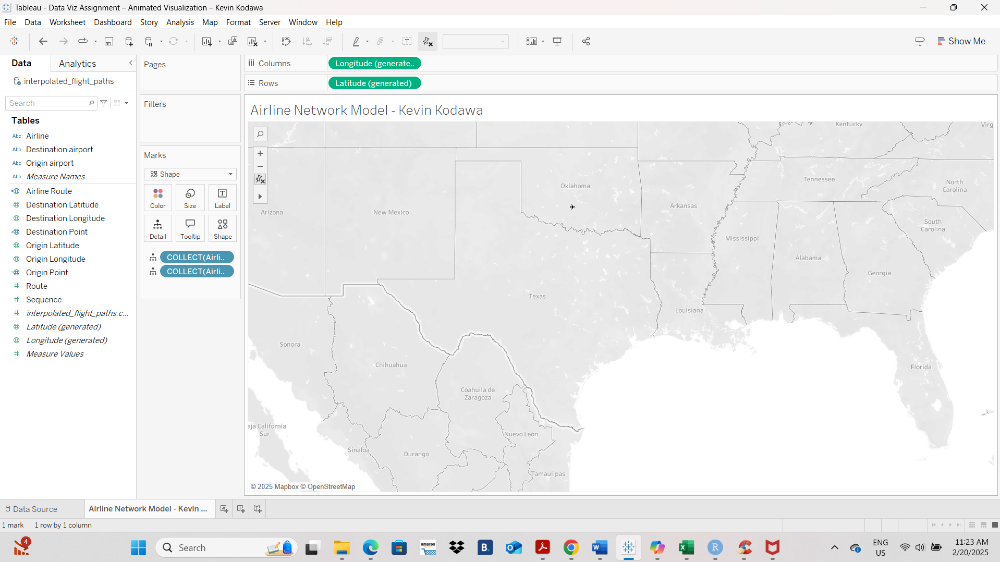
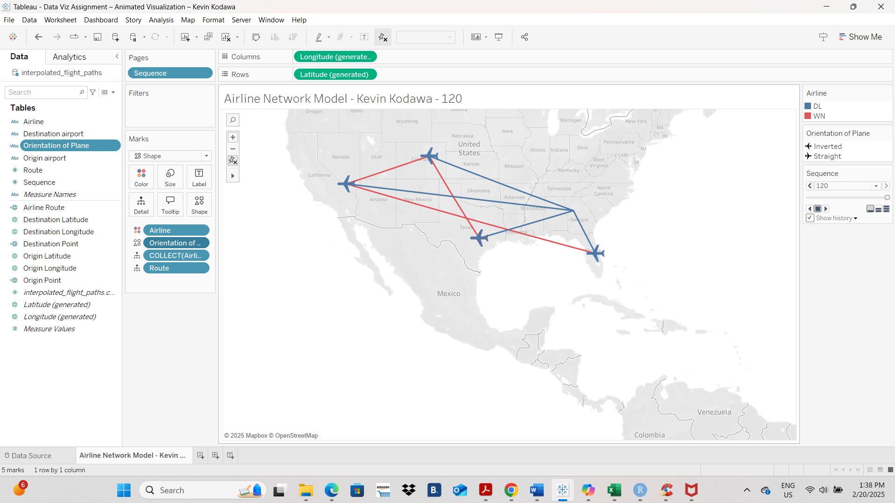
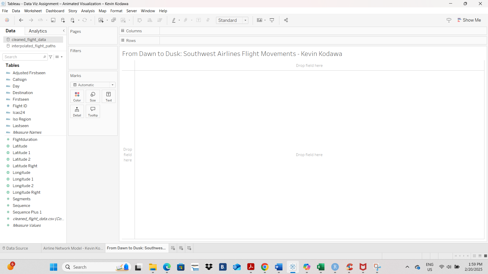
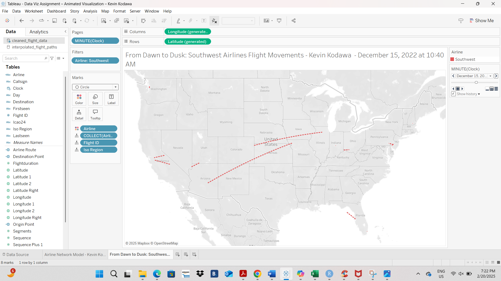
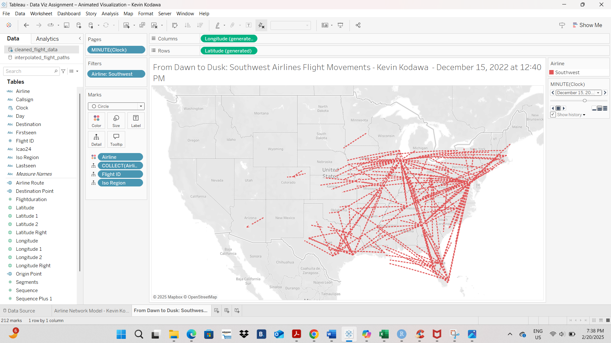
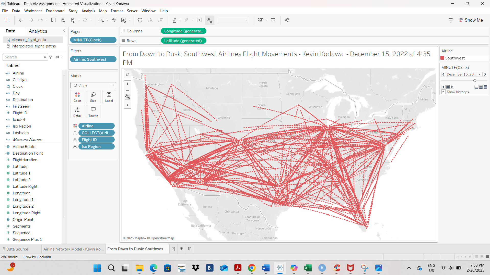
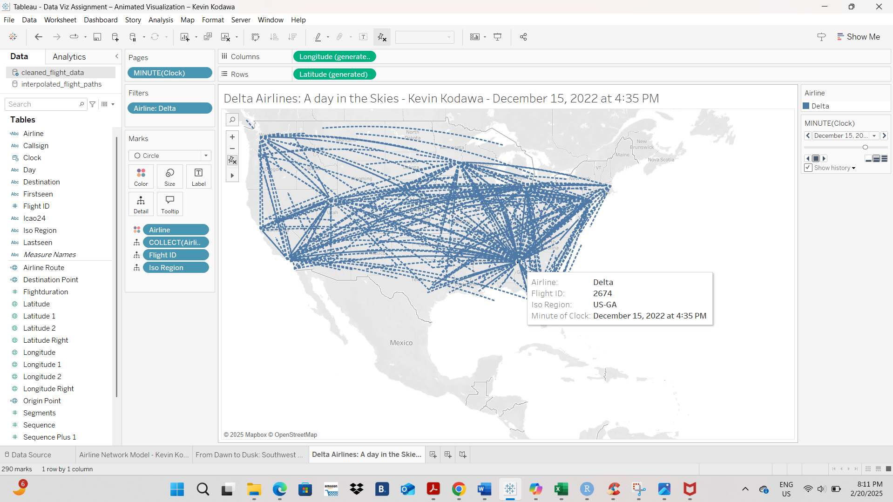
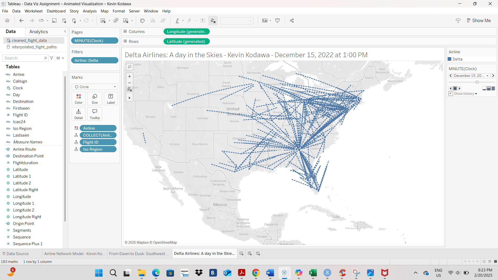

# ✈️ Animated Airline Route Visualization — Tableau

An animated geospatial analysis built in **Tableau Desktop** that visualizes how U.S. airlines structure their route networks, and animates a full day of flight activity minute-by-minute using real ADS-B flight-tracking data.

## Skills Demonstrated
- **Geospatial mapping** — plotted flight routes using `MAKEPOINT()` and `MAKELINE()` calculated fields to convert raw latitude/longitude pairs into mappable geographic objects
- **Custom mark shapes** — imported a custom airplane icon into Tableau's Shape Repository and dynamically oriented it (straight vs. inverted) based on direction of travel, using a calculated `Orientation of Plane` field
- **Time-based animation (Pages shelf)** — built two different animation mechanisms: a discrete `Sequence` field (for the 4-airport route model) and a continuous `MINUTE(Clock)` field (for the full-day network), each with trail/history settings to show flight paths accumulating over time
- **Multi-source data modeling** — connected and worked across two distinct data sources: a small interpolated dataset (`interpolated_flight_paths.csv`) for a clean 4-airport demo, and a large real-world dataset (`cleaned_flight_data.csv`) for full network analysis
- **Comparative network analysis** — contrasted the two dominant airline route models: **Point-to-Point** (Southwest) vs. **Hub-and-Spoke** (Delta)
- **Geographic/temporal pattern reading** — identified peak vs. low-activity periods, regional connectivity hubs (by ISO Region), and coast-to-coast traffic shifts throughout the day
- **Dashboard storytelling** — organized findings into named, purpose-built worksheets rather than a single cluttered view

## Project Overview
Using real flight-tracking data for Delta and Southwest Airlines, this project builds up in two stages:

**Stage 1 — Route Network Model (4 airports)**
A simplified visualization using `interpolated_flight_paths.csv` to clearly show the mechanics of the two dominant airline network designs:
- **Point-to-Point Model** (Southwest) — aircraft fly directly between two destinations, no central hub
- **Hub-and-Spoke Model** (Delta) — flights route through a central hub airport where passengers transfer

**Stage 2 — Full-Day Network Animation**
Using the larger `cleaned_flight_data.csv` dataset, the analysis scales up to *all* Southwest and Delta flights over a single day (Dec 14–15, 2022), animated minute-by-minute to reveal:
- **Delta** operates a clear hub-and-spoke pattern anchored on **Atlanta, GA (US-GA)** — nearly all Delta routes converge on this single hub, meaning a disruption there would ripple across the entire network, whereas an isolated route failure elsewhere is easily rerouted through the hub.
- **Southwest** operates a decentralized point-to-point mesh — no single dominant hub, so an operational failure on one route has a more contained, localized impact rather than cascading network-wide.
- Both networks show the same daily rhythm: activity is lowest overnight (~early AM hours), the network becomes noticeably **east-coast-dense with minimal west-coast activity** during a specific window (visible red concentration around GA/eastern seaboard), and by mid-afternoon (~4:35 PM) connectivity peaks across regions including the Southeast and Texas/Gulf region.

The final deliverable animates full-day flight movement for each airline side by side, with trailing flight paths that build up over time to reveal network structure at a glance.

## Screenshots

### Stage 1: Route Network Model (4-airport demo)

**Custom airplane mark shapes** — imported into Tableau's Shape Repository and later mapped to flight bearing so each plane icon visually points in its direction of travel (straight = outbound, inverted = return).

  
  

**Data source setup** — importing `interpolated_flight_paths.csv` and configuring the workbook.

**Calculated fields** — `Origin Point` and `Destination Point` built with `MAKEPOINT()`, and a `Route` field built with `MAKELINE()` to draw the connecting flight path between the two points.

**Base route plot** — initial plot of `Airline Route` on the map before styling.

**Airplane shape orientation** — the `Orientation of Plane` calculated field switches each mark between the straight and inverted airplane icon depending on flight direction.

**Point-to-point vs. hub-and-spoke, in motion** — Southwest (red) shows direct point-to-point connections while Delta (blue) converges through a shared hub, both animated using the `Sequence` field on the Pages shelf.

### Stage 2: Full-Day Network Animation (all flights, Dec 14–15, 2022)

**Southwest Airlines — point-to-point network**, animated via `MINUTE(Clock)` on the Pages shelf with trail history enabled, showing the network building up over the course of the day.

**Delta Air Lines — hub-and-spoke network**, same animation setup applied to the Delta subset, showing routes converging on the Atlanta hub (tooltip confirms flight-level detail: Flight ID, ISO Region, timestamp).

## Tools & Data
- **Tool:** Tableau Desktop
- **Data:**
  - `interpolated_flight_paths.csv` — a small, clean dataset of interpolated coordinates for 4 airports, used to demonstrate the core route-modeling mechanics
  - `cleaned_flight_data.csv` — real-world ADS-B flight-tracking data (origin/destination, lat/long, timestamps, ISO region) for every Southwest and Delta flight over a full day
- **Workbook:** [`Airline_Route_Network_Analysis.twbx`](Airline_Route_Network_Analysis.twbx)

## Key Takeaways
- Animation isn't just decoration here — the minute-by-minute build-up of flight paths makes the *structural difference* between the two network models immediately intuitive: Southwest's map fills in as a scattered web, while Delta's converges into a visible star pattern centered on Atlanta.
- **Network resilience differs by design:** Delta's hub-and-spoke model concentrates risk — an operational failure at the Atlanta hub would disrupt the majority of the network — while Southwest's point-to-point mesh contains failures to a single route, at the cost of needing many more direct connections to cover the same map.
- **Time-of-day patterns are consistent across both airlines:** activity troughs overnight, a window of heavy east-coast concentration with minimal west-coast movement, and an afternoon peak in connectivity — a reminder that even very different network topologies still run on the same underlying travel-demand clock.
